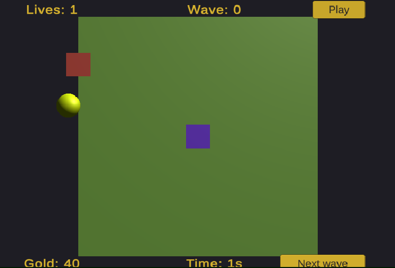

# itdef

Yet another attempt at a tower defense, this time with Unity.

# Goal

Incrementally create a top down open world tower defense by adding features little by little. The desired final state would be that the app offers:
* ✅ a menu to pick the difficulty
* ✅ a base should be defended against successive waves of mobs
* ✅ there is at least one type of mob
* there is at least one type of tower to attack mobs
* ✅ there are walls to prevent the passage of mobs
* walls can't be placed so that they cut off the base from portals
* ✅ the player can only place towers and walls on a grid
* ✅ mobs are following a path following the grid
* ✅ the player loses when no lives are left
* the player earns money when killing a mob
* ✅ placing walls and towers cost money
